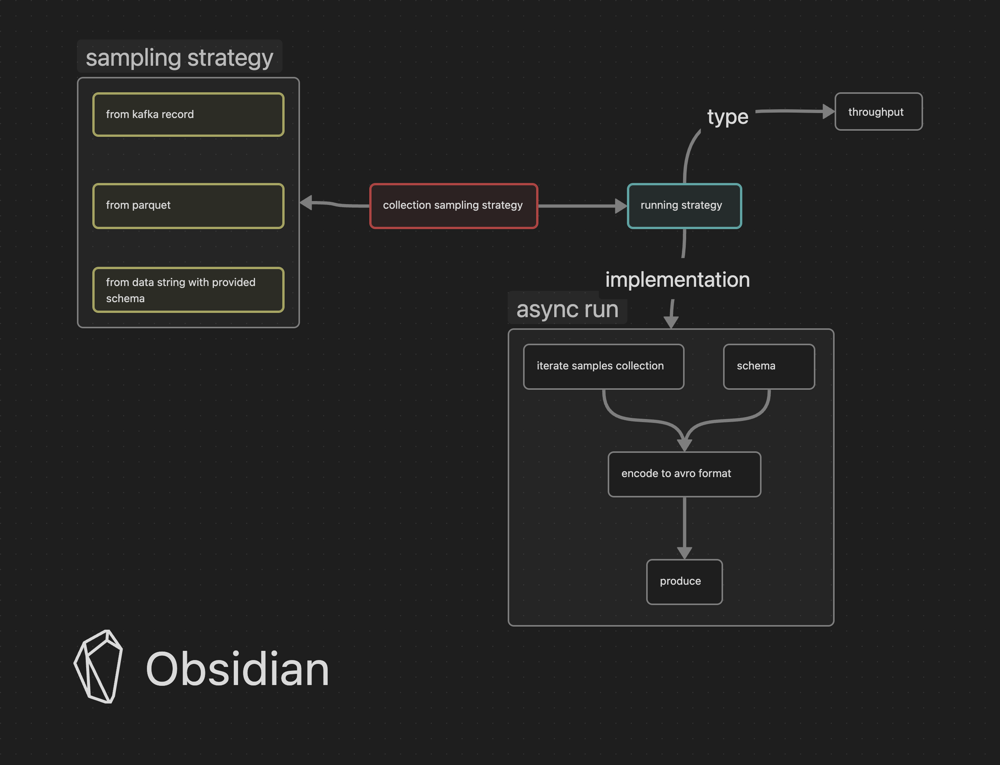

# overview
produce message on configured strategy 


# getting started
## configuration
- follow `RON` format
```ron
ConfigFile (
    librdkafka: {
        "bootstrap.servers": "",
        "security.protocol" : "SASL_SSL",
        "ssl.ca.location" : "ca_root.crt",
        "sasl.username" : "",
        "sasl.password" : "",
        "sasl.mechanisms" : "",
    },
    strategy: StrategyConfig (
        name: "throuthput config",
        typ3: Throughput,
        throughput: Some(ThroughputStrategy (
            rate: 10,
            size: 10
        ))
    ),
    schema_registry_url: "http://tools-on-premise-kafka-nprod.vn.nonprod:8081"
)
```

## build and run
```shell
$ cargo run --package kafka-client-rs --bin main -- \
  --config config.ron \
  --topic BDP.VN.DEV.INTERNAL
```

# development
## sampling
- create new sampling strategy file under `sampling/` and implement generator trait for them
```rust
pub struct PayloadSamplingGenerator {
    pub length_of_data: usize,
}

impl SamplingGenerator<T> for PayloadSamplingGenerator {
    fn generate(&self) -> T {
        todo!()
    }
}
```
- implement iterator for the <T> collection `CollectionIterator<T, dyn SamplingGenerator<T>>`
```rust
pub type TCollectionIterator<'a> =
CollectionIterator<'a, T, dyn SamplingGenerator<T>>;
impl<'a> Iterator for TCollectionIterator<'a> {
    type Item = T;
    fn next(&mut self) -> Option<Self::Item> {
        todo!("iterate next T from T collection")
    }
}
```

## strategy
- create new crate under `strategy/` folder
- add your own `OwnStrategy` struct which can be deserialized via `config.ron`
- implement trait `RunnableStrategy` for your `OwnStrategy`

```rust
#[derive(Debug, Deserialize, Clone)]
pub struct OwnStrategy {
    pub rate: u32,
    pub size: u32,
}

impl<'a> RunnableStrategy<'a> for OwnStrategy {
    // implemented `TCollectionIterator` from above sampling example 
    type CollectionIterator = TCollectionIterator<'a>;

    fn get_collection(&self, ctx: CollectionContext) -> Self::Collection {
        todo!("return iterable collection!")
    }

    /// run strategy
    fn run(&self, topic: &str, ctx: &Context) {
        todo!("implement your strategy")
    }
}

```
